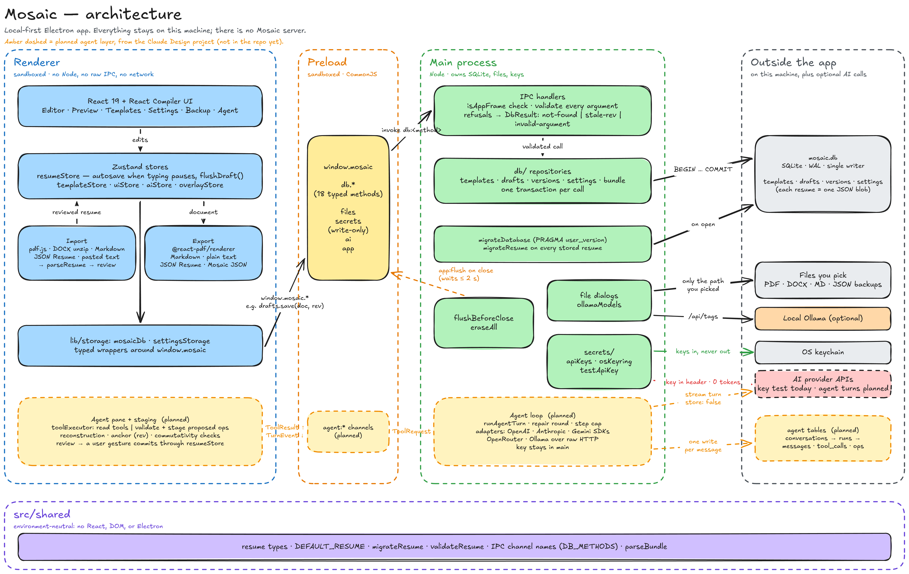

# Architecture

How Mosaic's processes divide the work, where data lives, and what crosses each boundary.
Paths are repository-relative. The rules live in the `CLAUDE.md` files; this is the map.

Amber dashed parts are the planned agent layer, taken from the Claude Design project; none
of it is in the repo yet. To change the diagram, open `docs/architecture.excalidraw` at
[excalidraw.com](https://excalidraw.com) or in the VS Code Excalidraw extension, then
export it as `architecture.png` at 2× scale.

## Processes

- **Renderer** (`src/renderer/`): React UI, Zustand stores, import readers, and exporters.
  Sandboxed: no Node, no raw IPC, no network. It reaches the rest of the app only through
  `window.mosaic`, wrapped by `lib/storage/mosaicDb.ts` and `settingsStorage.ts`.
- **Preload** (`src/preload/index.ts`): the only bridge. It exposes `db` (one method per
  entry in `DB_METHODS`), `files`, `secrets`, `ai`, and `app`, each a narrow typed call.
  `secrets` can save, test, and remove a key, but has no way to read one.
- **Main** (`src/main/`): owns the window, SQLite, the file dialogs, the keychain, and
  every network call. Each handler checks `isAppFrame`, validates its arguments, and
  refuses with a `DbResult` code (`not-found`, `stale-rev`, `invalid-argument`).
- **Shared** (`src/shared/`): contracts and logic every process uses: resume types,
  `DEFAULT_RESUME`, `migrateResume`, `validateResume`, IPC channel names, `parseBundle`.
  No React, DOM, or Electron.

## An edit's path to disk

1. The editor changes `resumeStore`, which bumps `rev` and schedules a save: 1 s after
   typing pauses, or at most 5 s into non-stop editing.
2. `drafts.save(templateId, doc, rev)` goes through the preload as `db:drafts.save`.
3. Main validates it and writes the draft and `templates.rev` in one transaction. A
   refused call writes nothing.
4. `flushDraft()` skips the wait. Anything that reads the current draft from the database
   (switch, duplicate, import, restore, backup) flushes first.

Opening a template, importing, and restoring go the other way: main writes the document,
and the renderer receives it through `loadDraft` without saving it back.

## Launch and close

- **Launch:** main opens `mosaic.db`, runs pending migrations, and sends `readBootState`
  (every setting, the template list, and the active draft). `hydrateStores` fills the
  stores before the first paint, so the theme and draft never flash.
- **Close:** main sends `app:flush`. The renderer saves what is pending and answers
  `app:flushed`; main waits up to 2 seconds.

## Where data lives

| What                                  | Where                                 | Owner |
| ------------------------------------- | ------------------------------------- | ----- |
| Templates, drafts, versions, settings | `userData/mosaic.db` (SQLite, WAL)    | main  |
| Each resume document                  | one JSON blob per row, not normalized | main  |
| API keys                              | OS keychain, or main's memory         | main  |
| Which providers have keys             | `app.apiKeys` setting (no key values) | main  |
| Exports, imports, backups             | files you pick in a system dialog     | you   |

Backups and Mosaic JSON are readable bundles (`src/shared/types/bundle.ts`). They never
include settings, AI configuration, keys, or conversations.

## Network

The renderer makes no requests. Main makes only these:

- `ollamaModels`: `/api/tags` and `/api/show` on the Ollama address in Settings.
- `testApiKey`: one request per test, costing no tokens, with the key in a header and
  never in the URL.

## Planned: the agent layer

From the Claude Design project's `src/lib/agent/README.md` and design memory:

- Main runs each turn (`runAgentTurn`) with the key and the provider SDKs: OpenAI,
  Anthropic, and Gemini through their SDKs; OpenRouter and Ollama over raw HTTP. Turns are
  stateless (`store: false`), so the transcript never lives on a provider's servers.
- Tool calls never change the document. Main sends a `ToolRequest`; the renderer answers
  reads or validates and stages proposed ops (reconstruction, anchor against `rev`,
  commutativity) and returns a `ToolResult`. Only a user gesture commits staged ops,
  through `resumeStore`.
- Conversations persist as `conversations → runs → messages · tool_calls · ops`, one write
  per assistant message. Staged suggestions never enter `drafts` or `versions`.
